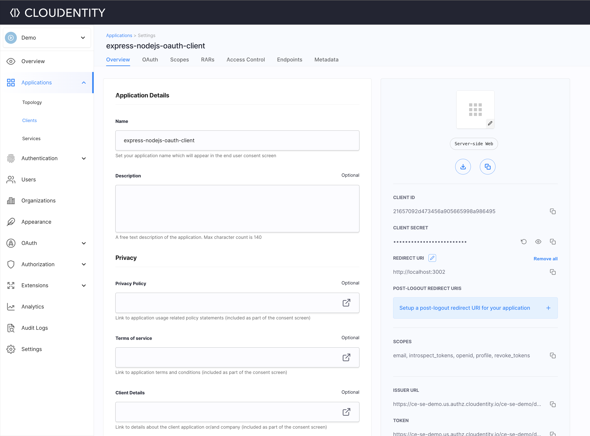
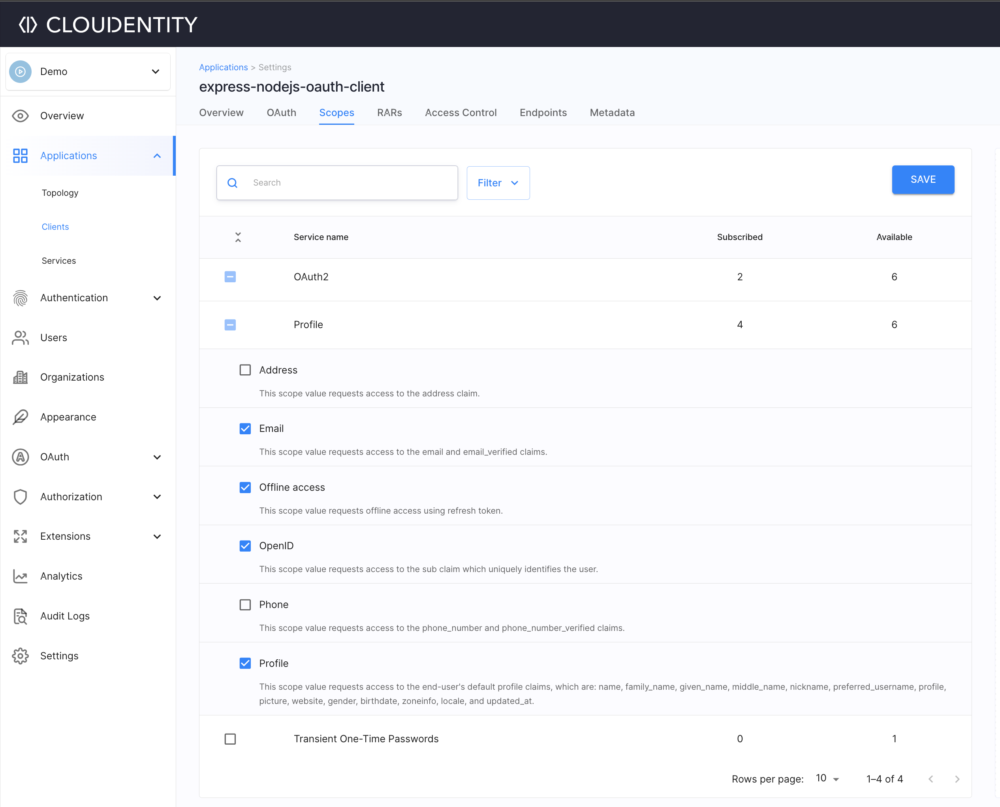
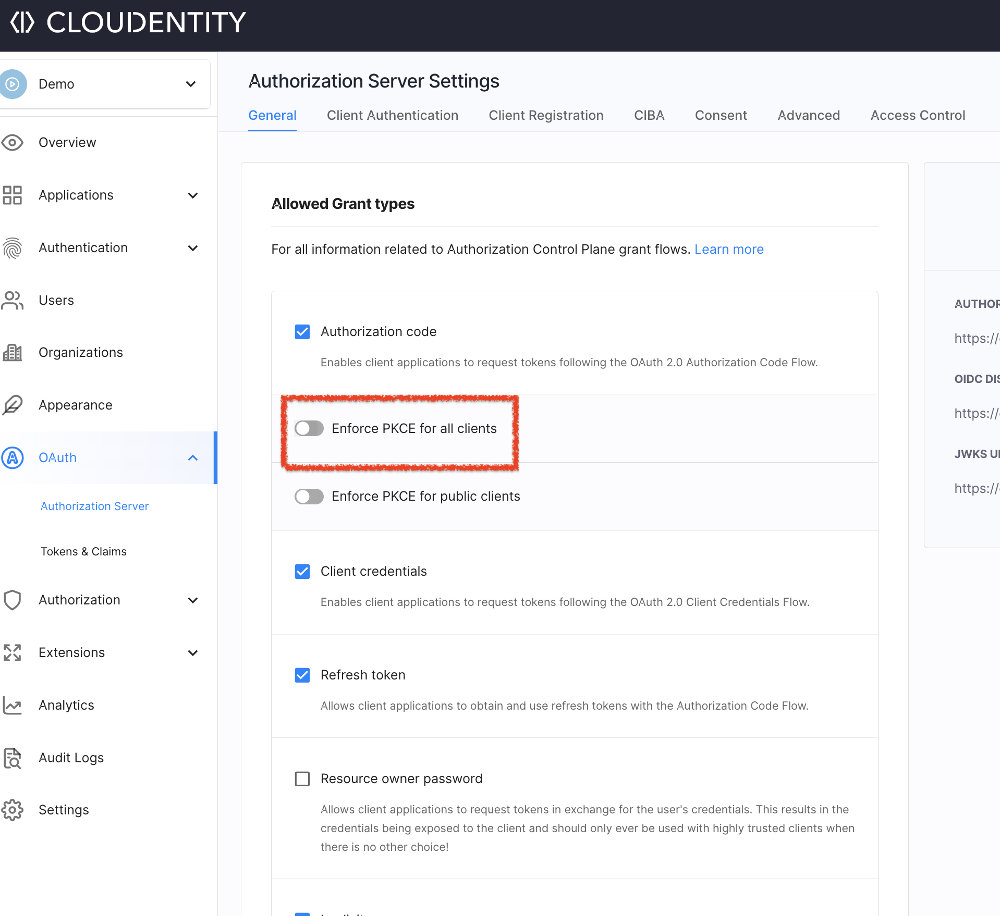
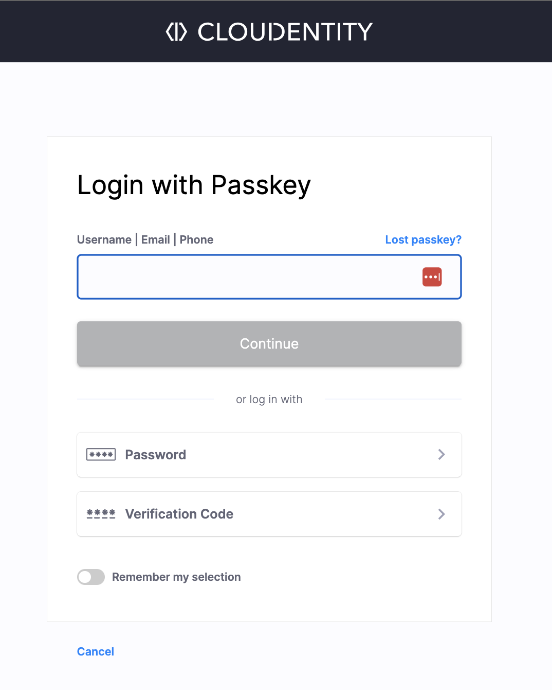
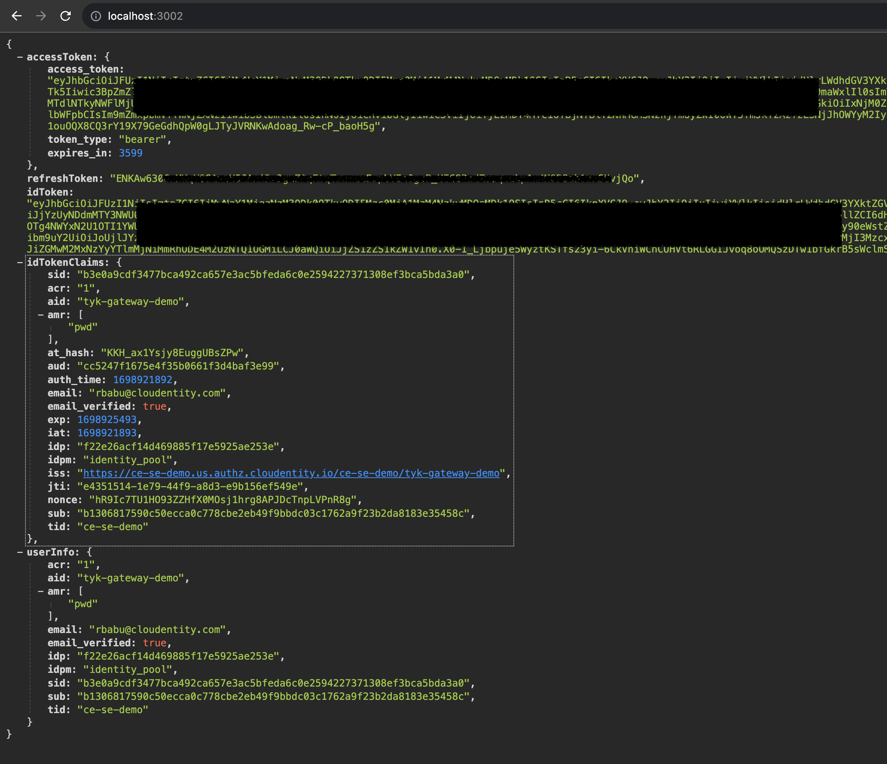

## About

Quickly add OAuth2/OpenId Connect to an [Express.js](https://expressjs.com/) app. In this sample, we will showcase how to easily fetch OAuth2 based [accessToken](https://cloudentity.com/developers/basics/tokens/access-token/), [refreshToken](https://cloudentity.com/developers/basics/tokens/refresh-token/), openid connect [idtoken](https://cloudentity.com/developers/basics/tokens/id-token/), token claims and user info within the express app.

## Run the application

**Minimum requirements:**

- NodeJS 20.x+
- NPM 10.x+

**Cloudentity SaaS Tenant**

- Register for a [free Cloudentity SaaS tenant](https://authz.cloudentity.io/register)

**Clone the repo**

Clone this github repo

**Install dependencies:**

```bash
# Make sure you are in the correct app directory
cd ce-samples-oauth2-openid-connect-nodejs-express

npm install
```

**Set environment values**

Open the `.env` file and configure these values after registering an OAuth Client application within the Cloudentity SaaS tenant

* Create a new workspace
* [Attach an identity pool with users](https://cloudentity.com/developers/howtos/identity/store-users/) or an external identity provider
* Create an OAuth client application


* Set redirect URL to `http://localhost:3002` 



* Subscribe to scopes to include `email`, `openid`, `profile` , `offline`



* Make sure PKCE is not enabled for all client applications




* Copy the below values from above created client application to `.env` file
  * `CLIENT ID`
  * `CLIENT SECRET`
  * `ISSUER URL`


**To start the dev server:**

```bash
node server.js
```

**Verify application**

* Launch `http://localhost:3002`

* User will be redirected to Cloudentity login page


* Authenticate the user

* You will see following tokens, claims and userInfo in the page



## More Information

Developers can use [Cloudentity platform](https://cloudentity.com/) for free to explore one of the most complete OAuth authorization server with advanced OAuth profile and a Financial-API Grade provider. [See pricing for different tiers](https://cloudentity.com/pricing/)

Use [Cloudentity developer portal](https://cloudentity.com/developers/) to explore more dev tutorials, integration articles and OAuth patterns

## Contact

For any issues with this repo, please mail issues to [support@cloudentity.com](mailto:support@cloudentity.com)
